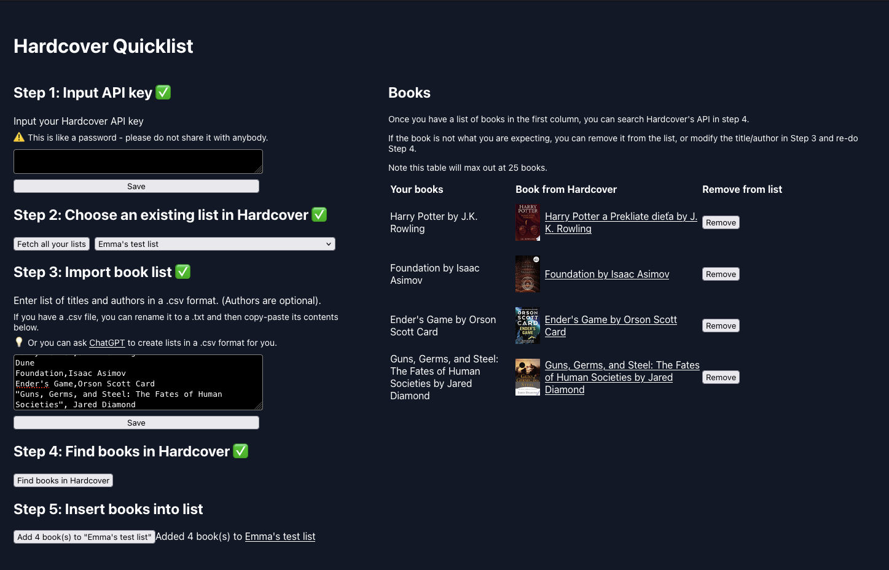

# Hardcover - Quicklist

This is a little React app I've created to add books to lists in Hardcover! Contributions welcome.

## Getting started

First time set-up:
`nvm use && npm install`

Regular development:
`npm start`

Runs the app in the development mode.
Open [http://localhost:3000](http://localhost:3000) to view it in the browser.



## Example .csv format
```
Title,Author
Harry Potter,J.K. Rowling
Dune
Foundation,Isaac Asimov
Ender's Game,Orson Scott Card
"Guns, Germs, and Steel: The Fates of Human Societies", Jared Diamond
```

- The `Title,Author` row is optional
- Book titles are compulsory, but authors are optional
- Make sure to include quotation marks `"` around book titles with commas in them

## Potential pitfalls

- If the book's name has some weird characters, it may fail to find the book
- The app attempts to find the book with a similar title, with the most amount of readers
    - e.g. a search for "Harry Potter" will return the first book in the Harry Potter series
    - However this means if there is a really niche book, the search may end up returning a different, more popular book than the one you originally searched for
    - To get around this, include the author as this should be more accurate

## Navigating the code
- The main app lives in `src/App.tsx`
- From there, I've broken down each of the steps into their own files inside of the `src/components` folder
- Any GraphQL queries I make to Hardcover's API are in the `src/api` folder